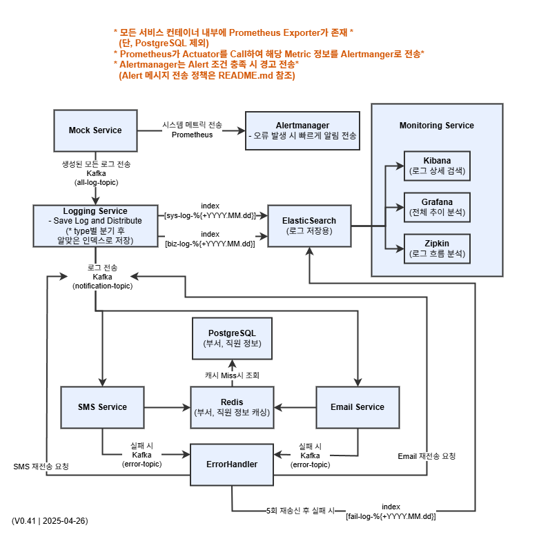

# 🚨 Distributed Event-Driven Alerting System

> Private MSA project for scalable, observable alerting system in distributed environments  
> Kafka 기반 비동기 이벤트 시스템으로 로그 수집 및 알림 전송을 담당하는 분산 아키텍처 프로젝트

---

## 📌 프로젝트 목적

본 프로젝트는 다양한 마이크로서비스에서 발생하는 로그를 Kafka 기반으로 수집하고,  
로그 레벨에 따라 알림을 비동기로 전송하며,  
장애 상황에 대한 복구 및 상태 모니터링까지 포함한 **확장 가능한 통합 알림 시스템**을 구축합니다.

- 비지니스 서비스의 로그를 일관된 방식으로 수집 (Filebeat)  
- 경고 이상 레벨 로그에 대한 비동기 알림 (SMS, Email) 전송  
- 전송 실패에 대한 재시도 및 실패 이력 관리  
- 로그 저장 및 분석 (Elasticsearch, Filebeat, Kibana, Grafana, Zipkin)  
- 전체 시스템 상태 감시 (Prometheus, Alertmanager)

---

## 🛠 기술 스택

| 영역            | 사용 기술                               			                   | 기술 설명									                  						                                                                                                                     |
|---------------|-----------------------------------------------------------|------------------------------------------------------------------------------------------------------------------------------------------------------------|
| Language      | Java 21                              			                  | 최신 LTS 버전의 Java를 기반으로 클라우드 및 컨테이너 환경에 최적화된 JVM 사용 						                                                                                                   |
| Framework     | Spring Boot 3.4.4                    			                  | REST API 제공, Kafka 통신, 설정 분리 등 서비스 전반을 구성하는 핵심 프레임워크						                                                                                                 |
| Messaging     | Apache Kafka                         			                  | 이벤트 기반 로그 처리 및 알림 트리거를 위한 메시지 브로커			          						                                                                                                       |
| Database      | PostgreSQL  Redis                 			                  | 사원/부서 정보를 저장하는 영속 저장소 알림 대상 정보 캐싱을 통한 성능 개선 및 트래픽 분산		 		                                                                                               |
| Log Forwarder | Filebeat                                                  | Mock 서비스에서 출력되는 stdout 로그를 수집하여 Kafka로 전달. 로그 포워딩을 위한 경량 수집기로, 설정이 간단하고 보안 관리가 용이함                                                                         |
| Log Storage   | Elasticsearch                        			                  | 업무 및 시스템 로그 저장, kibana 연동을 통한 검색 및 조회 기능 제공							   	                                                                                                     |
| Monitoring    | Prometheus Alertmanager Grafana Kibana Zipkin | 애플리케이션 상태(Memory, CPU, Health 등) 및 요청 지표 수집을 위한 모니터링 시스템 이상 상태 감지 시 알림 전송(Slack, 메일 등 연동 가능) 그래프 기반 대시보드 시각화 상세 로그 검색 및 분석 서비스 호출 흐름 및 트레이스 추적 |
| Build Tool    | Gradle (Groovy DSL) Checkstyle                			      | 멀티 모듈 환경에서 효율적인 의존성 및 빌드 관리 Checkstyle을 통해 빌드 타임에 코드 스타일 검사 수행												                                                                              |
| Deployment    | Docker Compose Kubernetes         			                  | 로컬 테스트용 경량 환경 구성 운영 환경에서 안정적이고 확장 가능한 MSA 배포를 위한 클러스터 			                                                                                               |
| CI/CD         | GitHub Actions (예정)                 			                   | 코드 변경 사항 자동 빌드 및 배포 자동화를 위한 워크플로											                                                                                                                |

---

## 🛠 사용 도구

| 영역                   | 사용 도구         | 도구 설명                                            |
|----------------------|---------------|--------------------------------------------------|
| JDK                  | OpenJDK 21    | 컨테이너 환경을 고려해 최신 LTS 버전인 Java 21 사용               |
| IDE                  | IntelliJ IDEA | 복잡한 멀티 모듈 구조를 효율적으로 관리하기 위한 통합 개발 환경             |
| Documents Management | Obsidian      | 구조적 문서화를 중시하여, 작성·탐색·관리가 용이한 Obsidian으로 문서 관리 수행 |

---

## 🏗 아키텍처 구성도

---

## 📦 주요 컴포넌트 설명

### 🔹 Mock Service
- 실제 서비스처럼 로그 이벤트를 발생시키는 테스트용 서비스입니다.
- 모든 로그는 Filebeat가 수집하여 Kafka의 all-log-topic으로 전송됩니다.
- 로그는 단일 Appender(CONSOLE)를 통해 출력되며, 로그 타입 구분은 MDC의 logtype 필드를 기반으로 이뤄집니다.
- 로그의 타입별 분기, 필드 필터링 및 저장은 logging-service가 담당합니다.
- **⚠ 개발시 주의사항**
  - [공통 컴포넌트 가이드 문서 참조](./docs/guide/development/common-component.md)
  - [mockup 가이드 문서 참조](./docs/guide/development/biz-mockup-services.md)
- **⚙ 기동시 주의사항**
  - [비지니스 및 mockup 서비스 기동 가이드 문서 참조](./docs/guide/startup/start-biz-mockup-service.md.md)

### 🔹 Logging Service
- Kafka에서 모든 로그를 수신하여 처리
- Elasticsearch의 `${logtype}-log-%{+YYYY.MM.dd}`에 저장
  - 로그 내의 logtype제거 후 저장
  - 어느 로그도 저장되지 않은 default는 logtype 그대로 저장
- WARN, ERROR 이상 로그는 Notification Service로 라우팅
  - notification-topic

### 🔹 Notification Services (SMS, Email)
- Kafka 토픽(`notification-topic`)에서 메시지 수신
- 수신자 정보는 Redis → PostgreSQL 순으로 조회
- 전송 실패 시 Kafka의 `error-topic`으로 메시지 이동

### 🔹 Error Handler
- Kafka 토픽(`error-topic`)으로 전달된 실패 메시지를 수신
- 최대 5회까지 재시도, 이후에도 실패 시 Elasticsearch의 `fail-log-%{+YYYY.MM.dd}`에 저장  
- 실패 사유는 리스트 형태로 기록 (e.g. timeout, connection refused 등)

### 🔹 Alertmanager
- Prometheus가 Actuator를 호출해 수집한 오류 상태 로그를 직접 수신
- 설정된 조건에 따라 오류로 판단시, Slack을 통해 즉시 알림 전송

---

### 📦 EFK 구성 (System/Biz Log 공통 저장)
- 로그 수집 (비지니스 컴포넌트에 한함)
  - 로그는 각 컨테이너의 Filebeat가 Kafka로 로그 전송
  - Console, File 어느 방법이든 로그를 쌓기만 하면 Filebeat가 전송 가능
- 로그 저장(Elasticsearch)
  - 인덱스 분리
    - biz-log-{YYYY.MM.DD} → 비즈니스 로그
    - sys-log-{YYYY.MM.DD} → 시스템 로그
    - act-log-{YYYY.MM.DD} → 서비스 매트릭, health 상태 등 actuator 기반 로그 저장
- 로그 조회
  - Kibana: 상세 검색
  - Grafana: 시스템 추이 시각화
  - Zipkin: 요청 추적

### 🧠 시스템 상태 감시 및 알림
- Prometheus: 모든 서비스의 상태를 Actuator endpoint 기반으로 수집 (PostgreSQL제외)
- Alertmanager:
  - Slack 등으로 자동 알림 발송
  - 알림 조건 및 정책은 README.md에 명시됨
  <!-- - 알림 조건 및 정책은 [Alert 정책 문서](#🧾-로그-처리-및-상태-감시-방식) 참고-->

---

## ⚙️ 아키텍처 특징 요약

- ✅ Kafka pub/sub 메시징 → 비동기 알림 구조  
- ✅ Partition Key: `hash(serviceId)` → 순서 보장 및 부하 분산  
- ✅ Redis + PostgreSQL 사용자 정보 조회 최적화  
- ✅ DLQ 구조 (send-error-topic)로 실패 메시지 분리  
- ✅ Elasticsearch 로그 저장 및 Kibana 검색  
- ✅ Prometheus 기반 서비스 상태 모니터링  
- ✅ Alertmanager를 통한 Slack 알림  

---

## 📂 Docker & K8s 구성
- 로컬 테스트 환경: `docker-compose.yaml`
- 클러스터 배포 환경: `Kubernetes` 설정 YAML
  → 모든 설정 파일들은 `docker/` 디렉토리에 포함되어 있습니다.

---

## 📚 포트폴리오 활용 포인트

- MSA 환경에서 확장 가능한 알림 시스템 구축 경험  
- Kafka 기반 비동기 메시징 구조 설계 및 구현  
- 로그 수집 파이프라인 구성  
- Prometheus + Alertmanager 상태 감시 시스템 연동  
- 장애 처리(DLQ, 재시도, Slack 알림) 전략 적용 경험  

---
## 📄 별첨 문서
- [작업 진행 이력(workflow.md)](./docs/workflow.md)
- [아키텍처 정의 및 변경 이력](./docs/architecture/architecture.md)