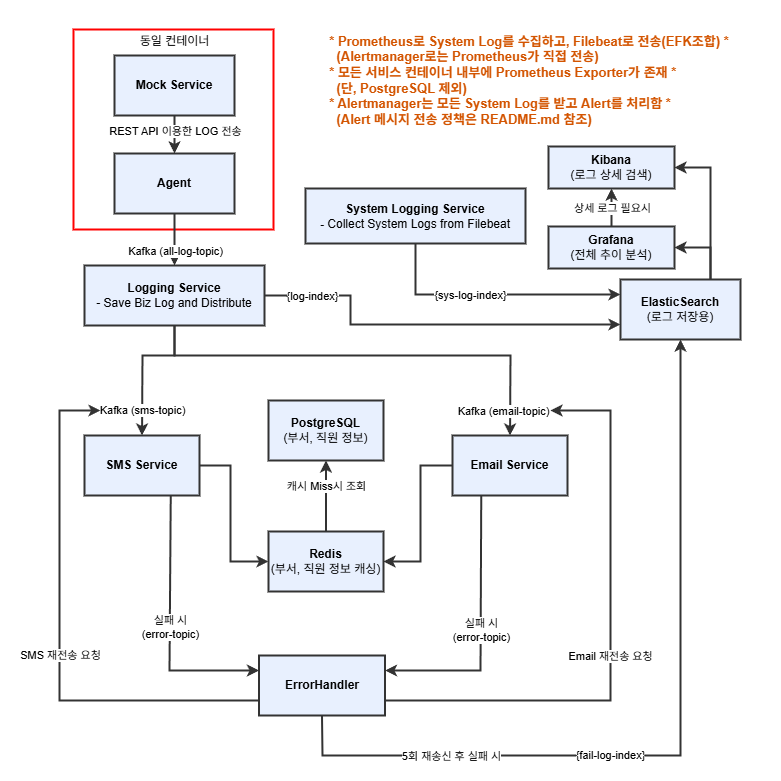

# 🚨 Distributed Event-Driven Alerting System

> Private MSA project for scalable, observable alerting system in distributed environments  
> Kafka 기반 비동기 이벤트 시스템으로 로그 수집 및 알림 전송을 담당하는 분산 아키텍처 프로젝트

---

## 📌 프로젝트 목적

본 프로젝트는 다양한 마이크로서비스에서 발생하는 로그를 Kafka 기반으로 수집하고,  
로그 레벨에 따라 알림을 비동기로 전송하며,  
장애 상황에 대한 복구 및 상태 모니터링까지 포함한 **확장 가능한 통합 알림 시스템**을 구축합니다.

- 모든 서비스의 로그를 일관된 방식으로 수집  
- 경고 이상 레벨 로그에 대한 비동기 알림 (SMS, Email) 전송  
- 전송 실패에 대한 재시도 및 실패 이력 관리  
- 로그 저장 및 분석 (Elasticsearch, Kibana, Grafana)  
- 시스템 상태 감시 (Prometheus, Alertmanager)

---

## 🛠 기술 스택

| 영역              | 사용 기술                               			| 기술 설명									                  						   |
|------------------|------------------------------------------------|--------------------------------------------------------------------------------------|
| Language         | Java 21                              			| 최신 LTS 버전의 Java를 기반으로 클라우드 및 컨테이너 환경에 최적화된 JVM 사용 						   |
| Framework        | Spring Boot 3.4.4                    			| REST API 제공, Kafka 통신, 설정 분리 등 서비스 전반을 구성하는 핵심 프레임워크						   |
| Messaging        | Apache Kafka                         			| 이벤트 기반 로그 처리 및 알림 트리거를 위한 메시지 브로커			          						   |
| Database         | PostgreSQL  Redis                 			| 사원/부서 정보를 저장하는 영속 저장소 알림 대상 정보 캐싱을 통한 성능 개선 및 트래픽 분산		 		   |
| Log Storage      | Elasticsearch                        			| 업무 및 시스템 로그 저장, kibana 연동을 통한 검색 및 조회 기능 제공							   	   |
| Log Shipping     | Filebeat (EFK 구성)                   			| 가볍고 빠른 로그 전송용 에이전트 (Logstash보다 설정이 간단)										   |
| Monitoring       | Prometheus Grafana Kibana Alertmanager| 서비스 상태 수집을 위한 모니터링 시스템 그래프 기반 대시보드 시각화 상세 로그 검색 및 분석 이상 상태 감지 시 알림 전송(Slack, 메일 등 연동 가능)|
| Build Tool       | Gradle (Groovy DSL)                  			| 멀티 모듈 환경에서 효율적인 의존성 및 빌드 관리												   |
| Deployment       | Docker Compose Kubernetes         			| 로컬 테스트용 경량 환경 구성 운영 환경에서 안정적이고 확장 가능한 MSA 배포를 위한 클러스터 			   |
| CI/CD            | GitHub Actions (예정)                 			| 코드 변경 사항 자동 빌드 및 배포 자동화를 위한 워크플로											   |

---

## 🏗 아키텍처 구성도

---

## 📦 주요 컴포넌트 설명

### 🔹 Mock Service
- 실제 서비스처럼 로그 이벤트를 발생시키는 테스트용 서비스
- Sidecar Agent와 함께 배포되어 로그를 전달

### 🔹 Agent
- Mock 서비스의 Sidecar로 배포되어 로그를 수집
- Kafka의 `all-log-topic`으로 로그를 전송

### 🔹 Logging Service
- Kafka에서 모든 로그를 수신하여 처리
- 모든 로그는 Elasticsearch의 `{log-index}`로 저장
- WARN, ERROR 이상 로그는 Notification Service로 라우팅

### 🔹 Notification Services (SMS, Email)
- Kafka 토픽(`sms-topic`, `email-topic`)으로부터 메시지 수신
- Redis → PostgreSQL 순으로 수신자 정보를 조회
- 전송 실패 시 Kafka의 `send-error-topic`으로 메시지를 이동

### 🔹 Error Handler
- 실패 메시지를 수신하여 최대 5회까지 재시도  
- 재시도 실패 시 Elasticsearch `{fail-log-index}`에 저장  
- 실패 사유는 리스트로 기록 (e.g. timeout, connection refused 등)

---

## 🧾 로그 처리 및 상태 감시 방식
### 📄 로그 분류 및 수집
1. Biz Log – Logging Service
  - Mock 서비스와 Agent에서 수집된 비즈니스 로그(Biz Log)는 Kafka로 전송되어 Logging Service에서 처리됩니다.
  - Logging Service는 해당 로그를 Elasticsearch에 저장하며, 알림이 필요한 로그는 별도의 Kafka Topic을 통해 알림 서비스로 전달합니다.

2. System Log – System Logging Service
  - 모든 컨테이너에는 Prometheus Exporter와 Filebeat가 내장되어 있습니다. (PostgreSQL제외)
  - Filebeat는 컨테이너 내부의 시스템 로그를 수집하여 System Logging Service로 전송합니다.
  - Prometheus는 서비스 상태를 주기적으로 수집하며, Alert조건 발생시 Alertmanager로 직접 전송합니다.
  - Alertmanager는 설정된 조건에 따라 Slack 등 외부 채널로 알림을 전송합니다.

### 📦 EFK 구성 (System/Biz Log 공통 저장)
- 로그 수집
  - 시스템 로그 → Filebeat
  - 비즈니스 로그 → Kafka 기반 직접 수집
- 로그 저장(Elasticsearch)
  - 인덱스 분리
    - log-index → 비즈니스 로그
    - sys-log-index → 시스템 로그
- 로그 조회
  - Kibana: 상세 검색
  - Grafana: 시스템 추이 시각화

### 🧠 시스템 상태 감시 및 알림
- Prometheus: 각 서비스의 상태를 Actuator endpoint 기반으로 수집
- Grafana: Prometheus로부터 수집된 데이터를 대시보드로 시각화
- Alertmanager:
  - Slack 등으로 자동 알림 발송
  - 알림 조건 및 정책은 README.md에 명시됨
  <!-- - 알림 조건 및 정책은 [Alert 정책 문서](#🧾-로그-처리-및-상태-감시-방식) 참고-->

---

## ⚙️ 아키텍처 특징 요약

- ✅ Sidecar 기반 로그 수집 → 중앙 수집점으로 통합  
- ✅ Kafka pub/sub 메시징 → 비동기 알림 구조  
- ✅ Partition Key: `hash(serviceId)` → 순서 보장 및 부하 분산  
- ✅ Redis + PostgreSQL 사용자 정보 조회 최적화  
- ✅ DLQ 구조 (send-error-topic)로 실패 메시지 분리  
- ✅ Elasticsearch 로그 저장 및 Kibana 검색  
- ✅ Prometheus 기반 서비스 상태 모니터링  
- ✅ Alertmanager를 통한 Slack 알림  

---

## 📂 Docker & K8s 구성
- 로컬 테스트 환경: `docker-compose.yaml`
- 클러스터 배포 환경: `Kubernetes` 설정 YAML
  → 모든 설정 파일들은 `docker/` 디렉토리에 포함되어 있습니다.

---

## 📚 포트폴리오 활용 포인트

- MSA 환경에서 확장 가능한 알림 시스템 구축 경험  
- Kafka 기반 비동기 메시징 구조 설계 및 구현  
- EFK 구조 로그 수집 파이프라인 구성  
- Prometheus + Grafana 상태 감시 시스템 연동  
- 장애 처리(DLQ, 재시도, Slack 알림) 전략 적용 경험  