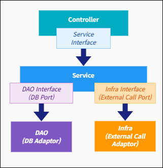

# 🧱 mockup-project-layers 구성도 설명

이 도식은 mockup 시스템 내에서 사용되는 각 컴포넌트의 계층 구조 및 책임을 시각적으로 표현한 구조도입니다.  
모든 mock 서비스는 동일한 계층 구조를 따르며, 이를 통해 아키텍처의 일관성과 테스트 범위를 정의합니다.

---

## 🧩 계층 구성

---

## 🧾 컴포넌트 설명

| 계층 | 설명 |
|------|------|
| **Controller** | 진입점. 클라이언트 요청을 수신 |
| **Service Interface** | 유즈케이스 계약. 인터페이스 기반으로 테스트 가능 |
| **Service** | 실제 로직 처리 계층 |
| **DAO Interface / DB Port** | DB 접근 추상화 계층 |
| **DAO** | 실제 DB 접근을 수행하는 구현체 |
| **External Call Interface** | 외부 시스템 호출 포트 |
| **Infra** | 외부 시스템과의 통신 구현체 (REST, gRPC 등)

---

## ✅ 목적

이 다이어그램은 다음을 시각적으로 설명합니다:

- 계층 간 역할 분리
- 의존성 방향 (Port → Adaptor)
- 내부 테스트 구조 통일성
- 추상화 계층의 분리와 결합 가능성

