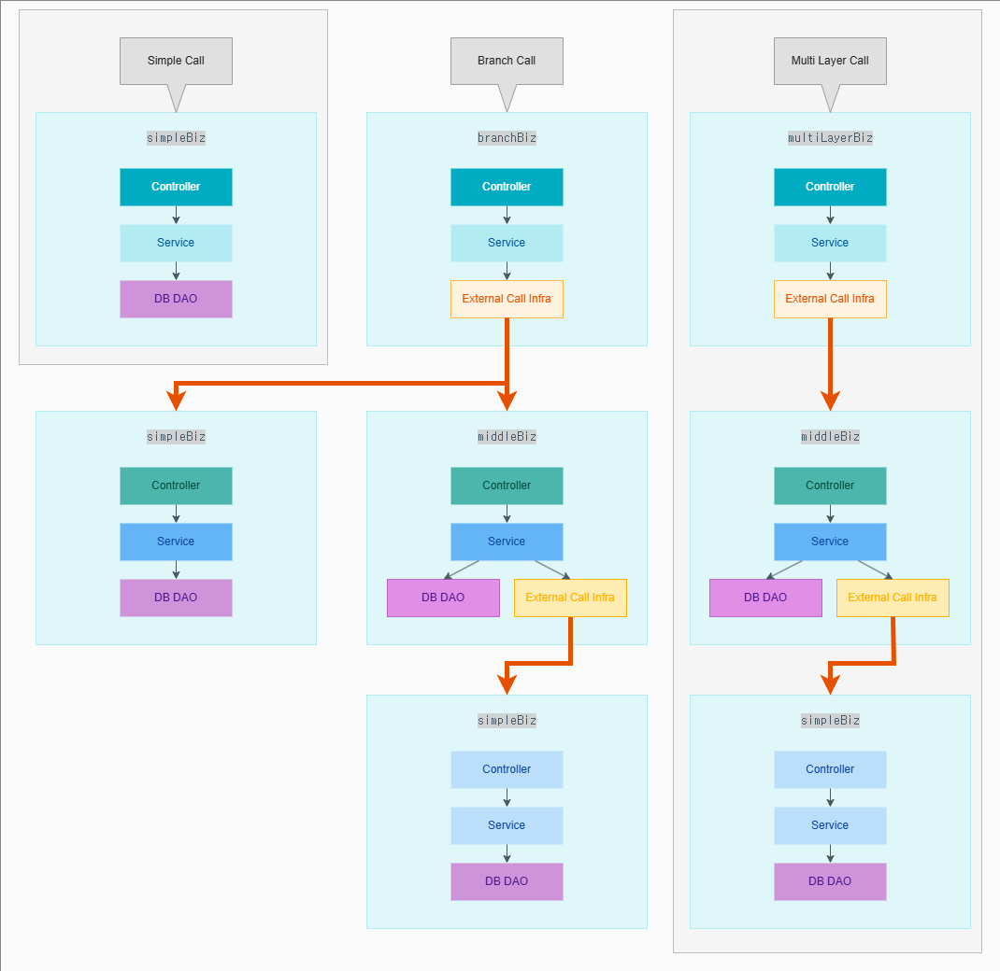

# 🧭 mockup-request-flow 구성도 설명

이 도식은 mockup 테스트 환경에서 흐름을 검증하기 위한 3가지 주요 시나리오 구조를 시각화한 것입니다.  
각 시나리오는 실제 테스트 가능한 mock 서비스 흐름을 표현하며, 중첩 호출 및 분기 구조를 명확하게 드러냅니다.

---

## 🧩 계층 구성

---

## 📂 테스트 시나리오 유형

### ✅ Simple Call

- 단일 mock 서비스 흐름
- `simpleBiz` mock에서 시작하여 Controller → Service → DB DAO 순으로 흐름 처리
- 기본적인 구조 검증 목적

---

### 🌿 Branch Call

- `branchBiz` mock이 외부 시스템을 호출하고,
- 이후 `middleBiz` mock으로 흐름이 전달됨
- `middleBiz`는 내부적으로 DB DAO와 External Call을 동시에 다루며,
- 마지막으로 `simpleBiz` mock으로 전달되어 최종 응답 구성

---

### 🪜 Multi Layer Call

- `multiLayerBiz` mock이 외부 시스템을 호출하며 시작
- 이후 `middleBiz` → `simpleBiz`로 연쇄 호출됨
- 각 계층에서 비즈니스 및 외부 연동 처리가 순차적으로 수행됨

---

## 📌 목적

이 구조는 다음을 검증하기 위한 테스트 환경으로 사용됩니다:

- 계층적 흐름 검증
- 중간 mock의 상태 변화 여부
- 외부 시스템과의 호출 흐름 확인
- 분기 및 병합 테스트 로직 구성

